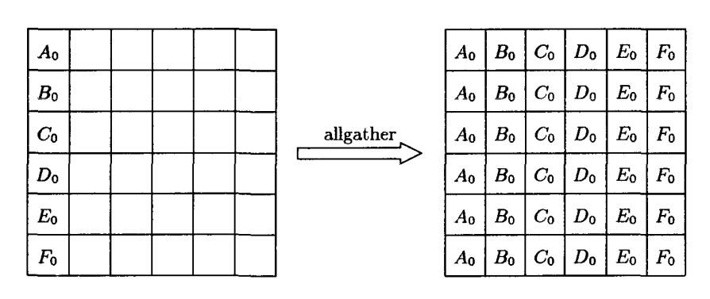
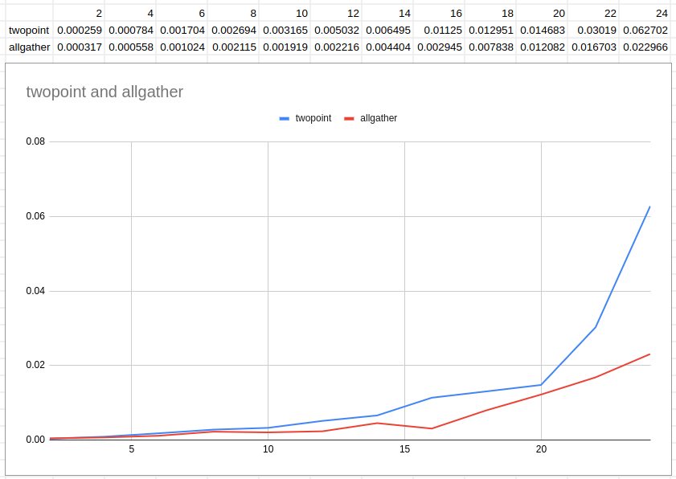

# Лабораторная работа 10-11. Коллективные обмены MPI. Отладка параллельных программ

Цели и задачи:  
Изучить различные групповые функции MPI.  
Сравнить реализацию коллективных обменов с помощью групповых функций и с помощью двухточечных обменов.

Вариант 8.

Реализовать рассылку значений со всех процессов на все с помощью двухточечных обменов.  
Эффективность реализации сравнить с функцией `MPI_Allgather()`.

## Решение с двухточечным обменом

Каждый процесс генерирует случайное число, рассылает его всем остальным, а так же получает сообщения от всех остальных.
После этого, каждый процесс отправляет время своей работы родительскому процессу, который вычисляет среднее арифметическое.

Исходный код приложения с комментариями.
```c
#include <stdio.h>
#include <string.h>
#include <time.h>
#include <stdlib.h>
#include "mpi.h"

int main(int argc, char *argv[])
{
    int size, rank;    /* total numer of procs and current proc numer */
    int parcel = 0;    /* the value to be send */
    double start, end; /* start and stop the transfer time*/
    const int parent_pid = 0;
    const int tag = 31415926;

    MPI_Init(&argc, &argv);               /* starts MPI */
    MPI_Comm_size(MPI_COMM_WORLD, &size); /* get total num of processes */
    MPI_Comm_rank(MPI_COMM_WORLD, &rank); /* get number of processes */

    /* generate parcel value */
    srand(time(NULL) + rank);
    parcel = rand() % 1025;

    /* We're saving all the packages we've received */
    int parcel_collection[size];
    memset(&parcel_collection, 0, size);

    printf("Process %d going to send %4d to everyone\n", rank, parcel);

    start = MPI_Wtime(); // fixing the "parcel start" time,
                         // locally for each process

    /* Send the parcel to everyone */
    for (int i = 0; i != size; i++)
        MPI_Send(&parcel, 1, MPI_INT, i, tag, MPI_COMM_WORLD);

    /* Revive the parcel from everyone */
    for (int i = 0; i != size; i++)
        MPI_Recv(&parcel_collection[i], 1, MPI_INT, i, tag, MPI_COMM_WORLD, MPI_STATUS_IGNORE);

    end = MPI_Wtime(); // fixing the "end of reception" time,
                       // locally for each process

    /* running time of the current process */
    double my_runtime = end-start;

    printf("Process %d collected the following values:", rank);
    for (int i = 0; i < size; i++)
        printf(" %4d", parcel_collection[i]);
    printf(" (runtime was %lfsec).\n", my_runtime);

    /* submit work time for processing */
    MPI_Send(&my_runtime, 1, MPI_DOUBLE, parent_pid, tag, MPI_COMM_WORLD);

    /* Only the parent process will process the total time */
    if (rank == parent_pid)
    {
        /* Revive the work time from everyone and calc the avg */
        double sum = 0;
        double tmp = 0;
        for (int i = 0; i != size; i++)
        {
            MPI_Recv(&tmp, 1, MPI_DOUBLE, i, tag, MPI_COMM_WORLD, MPI_STATUS_IGNORE);
            sum += tmp;
        }
        double runtime = sum / size;
    
        printf("---\nAvg runtime was %lf.\n", runtime);
    }

    /* completes MPI */
    MPI_Finalize();
    return 0;
}
```

Компиляция и запуск приложения на 6 ядрах

```sh
$ mpicc twopoint.c -o twopoint

$ mpiexec -n 6 twopoint
Process 1 going to send  967 to everyone
Process 4 going to send  221 to everyone
Process 2 going to send  753 to everyone
Process 3 going to send  992 to everyone
Process 5 going to send  443 to everyone
Process 0 going to send  644 to everyone
Process 1 collected the following values:  644  967  753  992  221  443 (runtime was 0.001397sec).
Process 4 collected the following values:  644  967  753  992  221  443 (runtime was 0.001482sec).
Process 0 collected the following values:  644  967  753  992  221  443 (runtime was 0.001351sec).
Process 2 collected the following values:  644  967  753  992  221  443 (runtime was 0.001596sec).
Process 3 collected the following values:  644  967  753  992  221  443 (runtime was 0.001625sec).
Process 5 collected the following values:  644  967  753  992  221  443 (runtime was 0.001622sec).
---
Avg runtime was 0.001512.
```

Запуск приложения с количеством процессов, большим чем число физических ядер приводит к появлению ошибки о недостаточности слотов. Это решается указанием флага `--oversubscribe` который позволяет "переподписываться" на освободившиеся слоты.

```txt
--------------------------------------------------------------------------
There are not enough slots available in the system to satisfy the 16
slots that were requested by the application:

  allgather

Either request fewer slots for your application, or make more slots
available for use.

A "slot" is the Open MPI term for an allocatable unit where we can
launch a process.  The number of slots available are defined by the
environment in which Open MPI processes are run:

  1. Hostfile, via "slots=N" clauses (N defaults to number of
     processor cores if not provided)
  2. The --host command line parameter, via a ":N" suffix on the
     hostname (N defaults to 1 if not provided)
  3. Resource manager (e.g., SLURM, PBS/Torque, LSF, etc.)
  4. If none of a hostfile, the --host command line parameter, or an
     RM is present, Open MPI defaults to the number of processor cores

In all the above cases, if you want Open MPI to default to the number
of hardware threads instead of the number of processor cores, use the
--use-hwthread-cpus option.

Alternatively, you can use the --oversubscribe option to ignore the
number of available slots when deciding the number of processes to
launch.
--------------------------------------------------------------------------
```

## Решение с коллективным обменом (MPI_Allgather)

Идея решения состоит в том, что заполнение происходит одной командой во всех процессах, таким образом не нужно отдельно выполнять отправку и получение каждого сообщения.



Исходный код приложения с комментариями.
```c
#include <stdio.h>
#include <string.h>
#include <time.h>
#include <stdlib.h>
#include "mpi.h"

int main(int argc, char *argv[])
{
    int size, rank;    /* total numer of procs and current proc numer */
    int parcel = 0;    /* the value to be send */
    double start, end; /* start and stop the transfer time*/
    const int parent_pid = 0;
    const int tag = 31415926;
    const int recvcount = 1;

    MPI_Init(&argc, &argv);               /* starts MPI */
    MPI_Comm_size(MPI_COMM_WORLD, &size); /* get total num of processes */
    MPI_Comm_rank(MPI_COMM_WORLD, &rank); /* get number of processes */

    /* generate parcel value */
    srand(time(NULL) + rank);
    parcel = rand() % 1025;

    /* We're saving all the packages we've received */
    int parcel_collection[size];
    memset(&parcel_collection, 0, size);

    printf("Process %d going to send %4d to everyone\n", rank, parcel);

    start = MPI_Wtime(); // fixing the "parcel start" time,
                         // locally for each process

    MPI_Allgather(&parcel, 1, MPI_INT, parcel_collection, recvcount, MPI_INT, MPI_COMM_WORLD);

    end = MPI_Wtime(); // fixing the "end of reception" time,
                       // locally for each process

    /* running time of the current process */
    double my_runtime = end-start;

    printf("Process %d collected the following values:", rank);
    for (int i = 0; i < size; i++)
        printf(" %4d", parcel_collection[i]);
    printf(" (runtime was %lfsec).\n", my_runtime);

    /* submit work time for processing */
    MPI_Send(&my_runtime, 1, MPI_DOUBLE, parent_pid, tag, MPI_COMM_WORLD);

    /* Only the parent process will process the total time */
    if (rank == parent_pid)
    {
        /* Revive the work time from everyone and calc the avg */
        double sum = 0;
        double tmp = 0;
        for (int i = 0; i != size; i++)
        {
            MPI_Recv(&tmp, 1, MPI_DOUBLE, i, tag, MPI_COMM_WORLD, MPI_STATUS_IGNORE);
            sum += tmp;
        }
        double runtime = sum / size;
    
        printf("---\nAvg runtime was %lf.\n", runtime);
    }

    /* completes MPI */
    MPI_Finalize();
    return 0;
}
```

Компиляция и запуск приложения на 6 ядрах

```sh
$ mpicc allgather.c -o allgather

$ mpirun -n 6 allgather
Process 1 going to send  546 to everyone
Process 2 going to send   15 to everyone
Process 4 going to send  176 to everyone
Process 0 going to send  753 to everyone
Process 5 going to send  468 to everyone
Process 3 going to send  466 to everyone
Process 1 collected the following values:  753  546   15  466  176  468 (runtime was 0.000756sec).
Process 2 collected the following values:  753  546   15  466  176  468 (runtime was 0.000766sec).
Process 3 collected the following values:  753  546   15  466  176  468 (runtime was 0.000655sec).
Process 0 collected the following values:  753  546   15  466  176  468 (runtime was 0.000781sec).
Process 4 collected the following values:  753  546   15  466  176  468 (runtime was 0.000791sec).
Process 5 collected the following values:  753  546   15  466  176  468 (runtime was 0.000718sec).
---
Avg runtime was 0.000745.
```

Уже на этом примере видно, что время работы гораздо меньше. Далее мы это рассмотрим на графике.


## Анализ реализаций

На представленном графике видно, что время исполнения кода для первого решения (двухточечное соединение) растёт быстрее, чем время для второго решения (allgather) по мере увеличения числа процессов. При большем объёме передаваемых данных, вероятно разница будет ещё более значительной.



Можно предположить, что какую-то часть в увеличение времени вносит и "переподписка" на доступные слоты, и на многоядерной системе график рос бы менее резко.