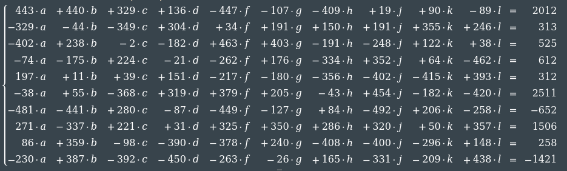
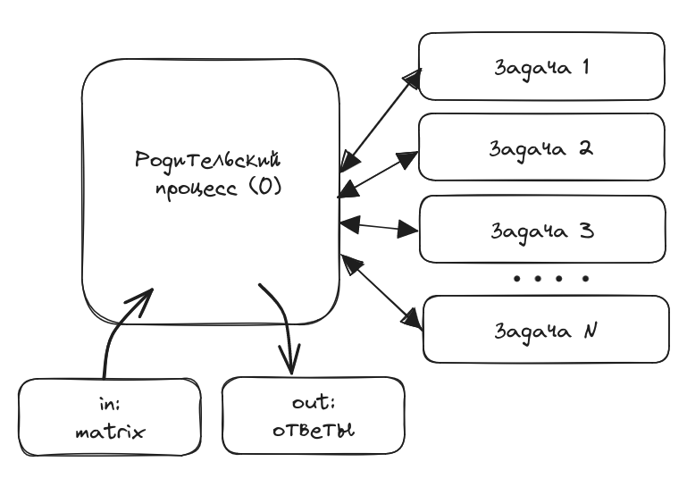
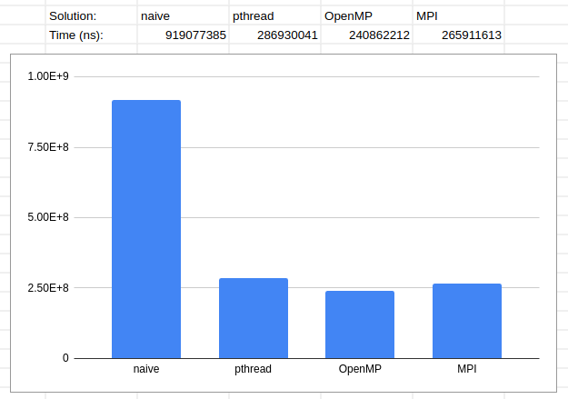

# Лабораторная работа 12. Решение прикладных задач с помощью MPI

Цели и задачи:  
Разработать алгоритм, реализовать и отладить параллельную программу для одной из задач линейной алгебры, вычислительной математики, обработки изображений или комбинаторики с помощью библиотеки MPI.

Вариант (Особый).

Реализовать решение системы линейных уравнений (без ограничения на количество уравнений) методом Крамера используя:
- последовательный подход
- pthreads
- OpenMP
- MPI

В тестовых целях сгенерируем случайную систему уравнений с 10-ю параметрами и проверим корни через он-лайн калькуляторы.



Построить соответствующие графики. Пояснить результаты.

## Общий алгоритм

Для чистоты эксеримента, в общую часть вынесено описание типа матрицы
```c
struct Matrix
{
    double *data;     // Contents of the matrix
    size_t row;       // Number of lines (equations)
    size_t col;       // Number of columns (including answers)
    size_t activeCol; // Number of columns
    bool *passedLine; // Excluded lines
};
```

И алгоритм вычисления детерминанта
```c
double determinant(struct Matrix *m, size_t colIt, size_t colSub /*col to be substituted*/)
{
    if (colIt == m->activeCol)
        return 1;

    double sum = 0;
    int sign = 1;
    for (size_t i = 0; i < m->row; ++i)
    {
        // Recursive way to reduce matrix dimension
        if (!m->passedLine[i])
        {
            m->passedLine[i] = true;
            // When we get to the column that needs to be replaced,
            // we take the values ​​from the very last column with the answers.
            size_t shift = colIt == colSub ? m->activeCol : colIt;
            sum += sign * m->data[i * m->col + shift] * determinant(m, colIt + 1, colSub);
            m->passedLine[i] = false;
            sign *= -1;
        }
    }
    return sum;
}
```

## Последовательный подход

Последовательный подход выполняет вычисления в однопоточном режиме

```c
#include <stdio.h>
#include <stdlib.h>
#include <math.h>
#include <limits.h>
#include <stdbool.h>
#include <float.h>
#include <stdint.h>
#include <time.h>

#include "matrix.h"

int main()
{
    struct Matrix m;
    // Read input from file
    FILE *fp = fopen("input.txt", "r");
    fscanf(fp, "%zu %zu", &m.row, &m.col);
    m.data = (double *)malloc(m.row * m.col * sizeof(double));
    m.passedLine = (bool *)malloc(m.row * sizeof(bool));
    for (size_t i = 0; i != m.row; ++i)
    {
        for (size_t j = 0; j != m.col; ++j)
        {
            fscanf(fp, "%lf", &m.data[i * m.col + j]);
        }
    }
    m.activeCol = m.col - 1;
    fclose(fp);

    double main_determinant = determinant(&m, 0, m.activeCol);
    if (fabs(main_determinant) < DBL_EPSILON)
    {
        printf("\nDetermining roots for a given system of equations is not possible.\n");
        return EXIT_SUCCESS;
    }

    struct timespec start, finish;
    clock_gettime(CLOCK_MONOTONIC, &start);

    double local_determinant[m.row];
    for (size_t sub = 0; sub < m.row; ++sub)
    {
        local_determinant[sub] = determinant(&m, 0, sub);
    }

    clock_gettime(CLOCK_MONOTONIC, &finish);
    long long diff = (finish.tv_sec - start.tv_sec) * 1000000000 + (finish.tv_nsec - start.tv_nsec);
    printf("Time elapsed was %lld ns \n", diff);

    // Getting roots and recording results
    fp = fopen("output.txt", "w");
    for (size_t i = 0; i != m.row; ++i)
    {
        double answer = local_determinant[i] / main_determinant;
        fprintf(fp, "%zu) %.2lf\n", i + 1, answer);
    }
    fclose(fp);

    free(m.data);
    free(m.passedLine);
    return EXIT_SUCCESS;
}
```

Запуск однопоточного решения
```sh
$ gcc -O2 -Wall -lm naive.c matrix.c -o naive

$ ./naive 
Time elapsed was 919077385 ns 

$ cat output.txt 
1) -0.97
2) 4.42
3) 4.65
4) 7.01
5) -2.06
6) 6.74
7) 4.59
8) -0.56
9) -4.86
10) -1.60
```
gcc -O2 -Wall -lm naive.c matrix.c -o naive

## pthreads

Решение с pthreads использует функцию обёртку для ручного управления памятью

```sh
#include <stdio.h>
#include <stdlib.h>
#include <math.h>
#include <stdbool.h>
#include <limits.h>
#include <float.h>
#include <stdint.h>
#include <time.h>
#include <string.h>
#include <pthread.h>

#include "matrix.h"


struct Params
{
    size_t id;
    double local_determinant;
    struct Matrix *m;
};

void *_determinant(void *params)
{
    struct Params *p = (struct Params *)params;
    p->m->passedLine  = (bool *)malloc(p->m->row * sizeof(bool)); // EXPENSIVE!
    memset(p->m->passedLine, 0, p->m->row * sizeof(bool));
    p->local_determinant = determinant(p->m, 0, p->id);
    pthread_exit(NULL);
}

int main()
{
    struct Matrix m;
    // Read input from file
    FILE *fp = fopen("input.txt", "r");
    fscanf(fp, "%zu %zu", &m.row, &m.col);
    m.data = (double *)malloc(m.row * m.col * sizeof(double));
    for (size_t i = 0; i != m.row; ++i)
    {
        for (size_t j = 0; j != m.col; ++j)
        {
            fscanf(fp, "%lf", &m.data[i * m.col + j]);
        }
    }
    m.activeCol = m.col - 1;
    fclose(fp);

    m.passedLine = (bool *)malloc(m.row * sizeof(bool));
    memset(m.passedLine, 0, m.row * sizeof(bool));
    double main_determinant = determinant(&m, 0, m.activeCol);
    free(m.passedLine);
    if (fabs(main_determinant) < DBL_EPSILON)
    {
        printf("\nDetermining roots for a given system of equations is not possible.\n");
        return EXIT_SUCCESS;
    }

    pthread_t threads[m.row];
    struct Params params[m.row];
    for (size_t i = 0; i != m.row; ++i)
    {
        params[i].id = i; // index
        params[i].m = &m; // matrix
    }

    struct timespec start, finish;
    clock_gettime(CLOCK_MONOTONIC, &start);

    // Run threads
    for (size_t i = 0; i != m.row; ++i)
    {
        pthread_create(&threads[i], NULL, _determinant, &params[i]);
    }
    // Waiting for threads to complete
    for (size_t i = 0; i != m.row; ++i)
    {
        pthread_join(threads[i], NULL);
    }

    clock_gettime(CLOCK_MONOTONIC, &finish);
    long long diff = (finish.tv_sec - start.tv_sec) * 1000000000 + (finish.tv_nsec - start.tv_nsec);
    printf("Time elapsed was %lld ns \n", diff);

    // Getting roots and recording results
    fp = fopen("output.txt", "w");
    for (size_t i = 0; i != m.row; ++i)
    {
        double answer = params[i].local_determinant / main_determinant;
        fprintf(fp, "%zu) %.2lf\n", params[i].id + 1, answer);
    }
    fclose(fp);

    free(m.data);
    return EXIT_SUCCESS;
}
```

Компиляция и запуск решения на pthread

```sh
$ gcc -O2 -Wall -lm -lpthread pthread.c matrix.c -o pthread

$ ./pthread 
Time elapsed was 286930041 ns

$ cat output.txt
1) -0.97
2) 4.42
3) 4.65
4) 7.01
5) -2.06
6) 6.74
7) 4.59
8) -0.56
9) -4.86
10) -1.60
```

## OpenMP

Решение с OpenMP так же требует ручного управления памятью, но является более выразительным с точки зрения читаемости и чистоты кода
```c
#include <stdio.h>
#include <stdlib.h>
#include <math.h>
#include <stdbool.h>
#include <limits.h>
#include <float.h>
#include <stdint.h>
#include <time.h>
#include <string.h>

#include <omp.h>

#include "matrix.h"

int main()
{
    struct Matrix m;
    // Read input from file
    FILE *fp = fopen("input.txt", "r");
    fscanf(fp, "%zu %zu", &m.row, &m.col);
    m.data = (double *)malloc(m.row * m.col * sizeof(double));
    for (size_t i = 0; i != m.row; ++i)
    {
        for (size_t j = 0; j != m.col; ++j)
        {
            fscanf(fp, "%lf", &m.data[i * m.col + j]);
        }
    }
    m.activeCol = m.col - 1;
    fclose(fp);

    m.passedLine = (bool *)malloc(m.row * sizeof(bool));
    memset(m.passedLine, 0, m.row * sizeof(bool));
    double main_determinant = determinant(&m, 0, m.activeCol);
    free(m.passedLine);
    if (fabs(main_determinant) < DBL_EPSILON)
    {
        printf("\nDetermining roots for a given system of equations is not possible.\n");
        return EXIT_SUCCESS;
    }

    double local_determinant[m.row];
    struct timespec start, finish;
    clock_gettime(CLOCK_MONOTONIC, &start);
#pragma omp parallel for firstprivate(m)
    for (size_t i = 0; i < m.row; ++i)
    {
        m.passedLine = (bool *)malloc(m.row * sizeof(bool)); // EXPENSIVE!
        memset(m.passedLine, 0, m.row * sizeof(bool));
        local_determinant[i] = determinant(&m, 0, i);
        free(m.passedLine);
    }
    clock_gettime(CLOCK_MONOTONIC, &finish);
    long long diff = (finish.tv_sec - start.tv_sec) * 1000000000 + (finish.tv_nsec - start.tv_nsec);
    printf("Time elapsed was %lld ns \n", diff);

    fp = fopen("output.txt", "w");
    for (size_t i = 0; i < m.row; ++i)
    {
        double answer = local_determinant[i] / main_determinant;
        fprintf(fp, "%zu) %.2lf\n", i + 1, answer);
    }
    fclose(fp);

    free(m.data);
    return EXIT_SUCCESS;
}
```

Запуск OpenMP решения

```sh
$ gcc -O2 -Wall -lm -fopenmp openmp.c matrix.c -o openmp

$ ./openmp 
Time elapsed was 240862212 ns 

$ cat output.txt 
1) -0.97
2) 4.42
3) 4.65
4) 7.01
5) -2.06
6) 6.74
7) 4.59
8) -0.56
9) -4.86
10) -1.60
```

## MPI

В решении с MPI мы имеем основной (родительский) процесс который осуществляет чтение матрицы, запись результатов и раздаёт задачи дочерним процессам.



Для изменения времени специально использовалась та же механика, что и в остальных задачах. В MPI есть свои методы замеры времени, но для обеспечения чистоты результата использовался общий подход.

```c
#include <stdio.h>
#include <stdlib.h>
#include <math.h>
#include <stdbool.h>
#include <limits.h>
#include <float.h>
#include <stdint.h>
#include <time.h>
#include <string.h>

#include "mpi.h"
#include "matrix.h"

#define PARENT_ID 0  /* taskId of first task */
#define MSG_TAG 3141 /* message tag */

int main(int argc, char **argv)
{
    int size = 0;
    int rank = 0;

    MPI_Init(&argc, &argv);               /* starts MPI */
    MPI_Comm_size(MPI_COMM_WORLD, &size); /* get current process id */
    MPI_Comm_rank(MPI_COMM_WORLD, &rank); /* get number of processes */

    if (rank == PARENT_ID)
    { /* parent process */

        struct Matrix m;

        /* Read input from file */
        FILE *fp = fopen("input.txt", "r");
        fscanf(fp, "%zu %zu", &m.row, &m.col);
        m.data = (double *)malloc(m.row * m.col * sizeof(double));
        for (size_t i = 0; i != m.row; ++i)
        {
            for (size_t j = 0; j != m.col; ++j)
            {
                fscanf(fp, "%lf", &m.data[i * m.col + j]);
            }
        }
        m.activeCol = m.col - 1;
        fclose(fp);

        m.passedLine = (bool *)malloc(m.row * sizeof(bool));
        memset(m.passedLine, 0, m.row * sizeof(bool));
        double main_determinant = determinant(&m, 0, m.activeCol);
        free(m.passedLine);
        if (fabs(main_determinant) < DBL_EPSILON)
        {
            printf("\nDetermining roots for a given system of equations is not possible.\n");
            MPI_Abort(MPI_COMM_WORLD, EXIT_FAILURE);
        }

        struct timespec start, finish;
        clock_gettime(CLOCK_MONOTONIC, &start);
        /* Send tasks to the workers */
        for (int pid = 1, id = 0; pid < size; pid++, id++)
        {
            MPI_Send(&m.row, 1, MPI_INT, pid, MSG_TAG, MPI_COMM_WORLD);
            MPI_Send(&m.col, 1, MPI_INT, pid, MSG_TAG, MPI_COMM_WORLD);

            MPI_Send(&(m.data[0]), m.row * m.col, MPI_DOUBLE, pid, MSG_TAG, MPI_COMM_WORLD);

            MPI_Send(&id, 1, MPI_INT, pid, MSG_TAG, MPI_COMM_WORLD);
        }

        /* Receive results from the workers */
        double local_determinant[m.row];
        for (int pid = 1, id = 0; pid < size; pid++)
        {
            MPI_Recv(&id, 1, MPI_INT, pid, MSG_TAG, MPI_COMM_WORLD, MPI_STATUS_IGNORE);
            MPI_Recv(&local_determinant[id], 1, MPI_DOUBLE, pid, MSG_TAG, MPI_COMM_WORLD, MPI_STATUS_IGNORE);
        }

        clock_gettime(CLOCK_MONOTONIC, &finish);
        long long diff = (finish.tv_sec - start.tv_sec) * 1000000000 + (finish.tv_nsec - start.tv_nsec);
        printf("Time elapsed was %lld ns \n", diff);

        fp = fopen("output.txt", "w");
        for (size_t i = 0; i < m.row; ++i)
        {
            double answer = local_determinant[i] / main_determinant;
            fprintf(fp, "%zu) %.2lf\n", i + 1, answer);
        }
        fclose(fp);

        free(m.data);
    }
    else
    { /* child process */

        struct Matrix m;

        MPI_Recv(&m.row, 1, MPI_INT, PARENT_ID, MSG_TAG, MPI_COMM_WORLD, MPI_STATUS_IGNORE);
        MPI_Recv(&m.col, 1, MPI_INT, PARENT_ID, MSG_TAG, MPI_COMM_WORLD, MPI_STATUS_IGNORE);
        m.data = (double *)malloc(m.row * m.col * sizeof(double));
        MPI_Recv(&(m.data[0]), m.row * m.col, MPI_DOUBLE, PARENT_ID, MSG_TAG, MPI_COMM_WORLD, MPI_STATUS_IGNORE);
        m.activeCol = m.col - 1;

        int id = 0;
        MPI_Recv(&id, 1, MPI_INT, PARENT_ID, MSG_TAG, MPI_COMM_WORLD, MPI_STATUS_IGNORE);

        m.passedLine = (bool *)malloc(m.row * sizeof(bool));
        memset(m.passedLine, 0, m.row * sizeof(bool));
        double local_determinant = determinant(&m, 0, id); // CALCULATION

        MPI_Send(&id, 1, MPI_INT, PARENT_ID, MSG_TAG, MPI_COMM_WORLD);
        MPI_Send(&local_determinant, 1, MPI_DOUBLE, PARENT_ID, MSG_TAG, MPI_COMM_WORLD);

        /* Perhaps this is redundant */
        free(m.passedLine);
        free(m.data);
    }

    /* completes MPI */
    MPI_Finalize();
    return EXIT_SUCCESS;
}
```

Демонстрация запуска приложения на 11 процессорах (в терминологии MPI)


```sh
$ gcc -O2 -Wall  -lm -lmpi mpi.c matrix.c -o mpi

$ mpirun --oversubscribe -n 11 mpi
Time elapsed was 265911613 ns 

$ cat output.txt 
1) -0.97
2) 4.42
3) 4.65
4) 7.01
5) -2.06
6) 6.74
7) 4.59
8) -0.56
9) -4.86
10) -1.60

```

## Графический анализ

На чарте представлено графическое распределение времени работы различных подходов



Размер столбика показывает время работы приложения (именно вычислительной части) в наносекундах. Чем меньше столбик, тем лучше производительность у решения.

Наилучшие показатели у OpenMP. Так же это решение отмечалось как наиболее выразительное, с точки зрения удобного поддержания кода. Худший результат у однопотопного решения. В предыдущих работах, однопоточное решение обычно демонстрировало лучшие результаты из-за малых объёмов вычислительной работе, но на системе из 10 уравнений отличия становятся заметными.

## Заключение

В данной работе мы использовали достаточно сложную (с вычислительной точки зрения) задачу, в которой можно видеть выигрыш от использования нескольких потоков и процессов.

Решение с pthread и OpenMP может быть улучшено в части аллокации памяти. В данный момент, для создания вспомогательного массива приходится алоцировать память в куче. Для улучшения производительности, можно попробовать алоцировать память на стеке, а в ещё лучше сделать одну алокацию памяти сразу для всех процессов, и определить для каждого свой допустимый участок. Минусом такого подхода будет все сложности, которые влечёт ручное управление памятью.

Для MPI, можно попробовать изменить подход по передаче параметров и данных между процессами. Сейчас используется несколько сообщений для передачи простых типов. Если выполнить сериализацию и деселиализацию данных, это может привести к улучшению быстродействия.