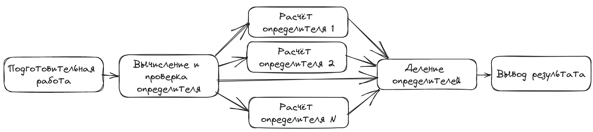

# Лабораторная работа 7. Отладка OpenMP–приложения: поиск ошибок, оптимизация

Цели и задачи:  
Изучить базовые методы и средства отладки многопоточных программ, в том числе и написанных с применением OpenMP.

Вариант 8.  
Дана последовательность натуральных чисел {a[0]...a[n–1]}. Создать OpenMP-приложение для поиска суммы ∑a[i], где a[i] -- четные числа.

## Поиск ошибок в участке кода

Отрывок `openmp_itc_8.c`
```c
...
  double a[N],b[N];
  a[0] = 2;
  # pragma omp parallel for nowait
  for (i=1; i<N; i++)
  {
    a[i] = a[i-1] * a[i-1];
    b[i] = a[i] + 1;
  }
  b[0]=a[N-1];
...
```

Очевидно, что в данном отрезке кода возникает состояние гонок (race condition) по данным в ячейке `a[N-1]`: запуская распараллеливание цикла с условием `nowait` приведёт к тому, что основной поток не будет ждать завершения выполнения дочерних потоков. В результате, один из дочерних потоков при обработке строки `a[i] = a[i-1] * a[i-1];` в какой-то момент произведёт запись в ячейку `a[N-1]`, а основной поток в строке `b[0]=a[N-1];` произведёт чтение из этой же ячейки. В каком порядке произойдут эти два события не определено.

Исправление: необходимо убрать `nowait`.

## Система линейных уравнений

Используя формулы Крамера, найти решение системы линейных уравнений.

a<sub>11</sub>x<sub>1</sub> + a<sub>12</sub>x<sub>2</sub> + a<sub>13</sub>x<sub>3</sub> + a<sub>14</sub>x<sub>4</sub> = b<sub>1</sub>  
a<sub>21</sub>x<sub>1</sub> + a<sub>22</sub>x<sub>2</sub> + a<sub>23</sub>x<sub>3</sub> + a<sub>24</sub>x<sub>4</sub> = b<sub>2</sub>  
a<sub>31</sub>x<sub>1</sub> + a<sub>32</sub>x<sub>2</sub> + a<sub>33</sub>x<sub>3</sub> + a<sub>34</sub>x<sub>4</sub> = b<sub>3</sub>  
a<sub>41</sub>x<sub>1</sub> + a<sub>42</sub>x<sub>2</sub> + a<sub>43</sub>x<sub>3</sub> + a<sub>44</sub>x<sub>4</sub> = b<sub>4</sub>  

Предусмотреть возможность деления на ноль. Входные данные: коэффициенты системы.  Оптимальное количество потоков выбрать самостоятельно.

###  Решения задания с помощью последовательной программы

Код программы
```c
#include <stdio.h>
#include <stdlib.h>
#include <math.h>
#include <stdbool.h>
#include <limits.h>
#include <float.h>

struct Matrix
{
    double *data;     // Contents of the matrix
    size_t row;       // Number of lines (equations)
    size_t col;       // Number of columns (including answers)
    size_t activeCol; // Number of columns
    bool *passedLine; // Excluded lines
};

double determinant(struct Matrix *m, size_t colIt, size_t colSub /*col to be substituted*/)
{
    if (colIt == m->activeCol)
        return 1;

    double sum = 0;
    int sign = 1;
    for (size_t i = 0; i < m->row; ++i)
    {
        // Recursive way to reduce matrix dimension
        if (!m->passedLine[i])
        {
            m->passedLine[i] = true;
            // When we get to the column that needs to be replaced,
            // we take the values ​​from the very last column with the answers.
            size_t shift = colIt == colSub ? m->activeCol : colIt;
            sum += sign * m->data[i * m->col + shift] * determinant(m, colIt + 1, colSub);
            m->passedLine[i] = false;
            sign *= -1;
        }
    }
    return sum;
}

int main()
{
    struct Matrix m;
    // Read input from file
    FILE *fp = fopen("input.txt", "r");
    fscanf(fp, "%zu %zu", &m.row, &m.col);
    m.data = (double *)malloc(m.row * m.col * sizeof(double));
    m.passedLine = (bool *)malloc(m.row * sizeof(bool));
    for (size_t i = 0; i != m.row; ++i)
    {
        for (size_t j = 0; j != m.col; ++j)
        {
            fscanf(fp, "%lf", &m.data[i * m.col + j]);
        }
    }
    m.activeCol = m.col - 1;
    fclose(fp);

    double main_determinant = determinant(&m, 0, m.activeCol);
    if (fabs(main_determinant) < DBL_EPSILON)
    {
        printf("\nDetermining roots for a given system of equations is not possible.\n");
        return EXIT_SUCCESS;
    }

    fp = fopen("output.txt", "w");
    for (size_t sub = 0; sub < m.row; ++sub)
    {
        double local_determinant = determinant(&m, 0, sub);
        double answer = local_determinant / main_determinant;
        fprintf(fp, "%zu) %.2lf\n", sub + 1, answer);
    }
    free(m.data);
    free(m.passedLine);
    fclose(fp);
    return EXIT_SUCCESS;
}
```

Демонстрация работы
```sh
$ gcc -std=c99 -Wall -pedantic -lm -O2 naive.c -o naive

$ cat input.txt 
4 5
-5 9 -7 4 -52
-3 4 -3 -4 -71
8 9 2 -8 -55
-3 7 5 -8 -152

$ time ./naive 
real	0m0.003s
user	0m0.000s
sys	0m0.003s

$ cat output.txt 
0) 9.00
1) -7.00
2) -4.00
3) 7.00
```

Вся работа выполняется последовательно в одном потоке.


###  Решения задания с помощью pthread программы

Код программы
```c
#include <stdio.h>
#include <stdlib.h>
#include <math.h>
#include <stdbool.h>
#include <limits.h>
#include <float.h>

#include <pthread.h>

struct Matrix
{
    double *data;     // Contents of the matrix
    size_t row;       // Number of lines (equations)
    size_t col;       // Number of columns (including answers)
    size_t activeCol; // Number of columns
    bool *passedLine; // Excluded lines
};

struct Params
{
    size_t id;
    double local_determinant;
    struct Matrix *m;
};

double determinant(struct Matrix *m, size_t colIt, size_t colSub /*col to be substituted*/)
{
    if (colIt == m->activeCol)
        return 1;

    double sum = 0;
    int sign = 1;
    for (size_t i = 0; i < m->row; ++i)
    {
        // Recursive way to reduce matrix dimension
        if (!m->passedLine[i])
        {
            m->passedLine[i] = true;
            // When we get to the column that needs to be replaced,
            // we take the values ​​from the very last column with the answers.
            size_t shift = colIt == colSub ? m->activeCol : colIt;
            sum += sign * m->data[i * m->col + shift] * determinant(m, colIt + 1, colSub);
            m->passedLine[i] = false;
            sign *= -1;
        }
    }
    return sum;
}

void *_determinant(void *params)
{
    struct Params *p = (struct Params *)params;
    p->m->passedLine = (bool *)malloc(p->row * sizeof(bool));
    memset(p->m->passedLine, 0, p->row * sizeof(bool));
    p->local_determinant = determinant(p->m, 0, p->id);
    free(p->m->passedLine);
    pthread_exit(NULL);
}

int main()
{
    struct Matrix m;
    // Read input from file
    FILE *fp = fopen("input.txt", "r");
    fscanf(fp, "%zu %zu", &m.row, &m.col);
    m.data = (double *)malloc(m.row * m.col * sizeof(double));
    for (size_t i = 0; i != m.row; ++i)
    {
        for (size_t j = 0; j != m.col; ++j)
        {
            fscanf(fp, "%lf", &m.data[i * m.col + j]);
        }
    }
    m.activeCol = m.col - 1;
    fclose(fp);

    m.passedLine = (bool *)malloc(m.row * sizeof(bool));
    memset(m.passedLine, 0, m.row * sizeof(bool));
    double main_determinant = determinant(&m, 0, m.activeCol);
    free(m.passedLine);
    if (fabs(main_determinant) < DBL_EPSILON)
    {
        printf("\nDetermining roots for a given system of equations is not possible.\n");
        return EXIT_SUCCESS;
    }

    pthread_t threads[m.row];
    struct Params params[m.row];
    for (size_t i = 0; i != m.row; ++i)
    {
        params[i].id = i; // index
        params[i].m = &m; // matrix
    }
    // Run threads
    for (size_t i = 0; i != m.row; ++i)
    {
        pthread_create(&threads[i], NULL, _determinant, &params[i]);
    }
    // Waiting for threads to complete
    for (size_t i = 0; i != m.row; ++i)
    {
        pthread_join(threads[i], NULL);
    }

    // Getting roots and recording results
    fp = fopen("output.txt", "w");
    for (size_t i = 0; i != m.row; ++i)
    {
        double answer = params[i].local_determinant / main_determinant;
        fprintf(fp, "%zu) %.2lf\n", params[i].id + 1, answer);
    }
    free(m.data);
    fclose(fp);
    return EXIT_SUCCESS;
}
```

Мы используем количество потоков, равное количеству уравнений. При большим количестве потоков, они будут "голодать". При меньшем -- пришлось бы самостоятельно выполнять диспетчеризацию потоков, а это не всегда эффективно.

Мы используем рекурсивный способ вычисления определителя, и для простоты работы с параметрами, над функцией `determinant()` была сделана обёртка `_determinant()`.

В отдельный поток была вынесена только функция расчёта детерминанта для каждого неизвестного. Вычисление общего детерминанта проводилось в главном потоке, т.к. логика требует его проверки на 0. Технически, можно вынести деление детерминантов в дочерние потоки, но если это делать с существующими потоками то это приведёт к передаче большего количества параметров (и снижению читаемости кода), а если создавать новые потоки, то накладные расходы себя не оправдают.

Демонстрация работы
```sh
$ cat input.txt 
4 5
-5 9 -7 4 -52
-3 4 -3 -4 -71
8 9 2 -8 -55
-3 7 5 -8 -152

$ gcc -std=c99 -Wall -pedantic -lm -lpthread -O2 pthread.c -o pthread

$ time ./pthread 
real	0m0.004s
user	0m0.000s
sys	0m0.004s

$ cat output.txt 
1) 9.00
2) -7.00
3) -4.00
4) 7.00
```

Схема потоков


###  Решения задания с помощью openmp программы

Код программы
```c
#include <stdio.h>
#include <stdlib.h>
#include <math.h>
#include <stdbool.h>
#include <limits.h>
#include <float.h>

#include <string.h>
#include <omp.h>

struct Matrix
{
    double *data;     // Contents of the matrix
    size_t row;       // Number of lines (equations)
    size_t col;       // Number of columns (including answers)
    size_t activeCol; // Number of columns
    bool *passedLine; // Excluded lines
};

double determinant(struct Matrix *m, size_t colIt, size_t colSub /*col to be substituted*/)
{
    if (colIt == m->activeCol)
        return 1;

    double sum = 0;
    int sign = 1;
    for (size_t i = 0; i < m->row; ++i)
    {
        // Recursive way to reduce matrix dimension
        if (!m->passedLine[i])
        {
            m->passedLine[i] = true;
            // When we get to the column that needs to be replaced,
            // we take the values ​​from the very last column with the answers.
            size_t shift = colIt == colSub ? m->activeCol : colIt;
            sum += sign * m->data[i * m->col + shift] * determinant(m, colIt + 1, colSub);
            m->passedLine[i] = false;
            sign *= -1;
        }
    }
    return sum;
}

int main()
{
    struct Matrix m;
    // Read input from file
    FILE *fp = fopen("input.txt", "r");
    fscanf(fp, "%zu %zu", &m.row, &m.col);
    m.data = (double *)malloc(m.row * m.col * sizeof(double));
    for (size_t i = 0; i != m.row; ++i)
    {
        for (size_t j = 0; j != m.col; ++j)
        {
            fscanf(fp, "%lf", &m.data[i * m.col + j]);
        }
    }
    m.activeCol = m.col - 1;
    fclose(fp);

    m.passedLine = (bool *)malloc(m.row * sizeof(bool));
    memset(m.passedLine, 0, m.row * sizeof(bool));
    double main_determinant = determinant(&m, 0, m.activeCol);
    free(m.passedLine);
    if (fabs(main_determinant) < DBL_EPSILON)
    {
        printf("\nDetermining roots for a given system of equations is not possible.\n");
        return EXIT_SUCCESS;
    }

    double local_determinant[m.row];
#pragma omp parallel for firstprivate(m)
    for (size_t i = 0; i < m.row; ++i)
    {
        m.passedLine = (bool *)malloc(m.row * sizeof(bool));
        memset(m.passedLine, 0, m.row * sizeof(bool));
        local_determinant[i] = determinant(&m, 0, i);
        free(m.passedLine);
    }

    double answer[m.row];
#pragma omp parallel for
    for (size_t i = 0; i < m.row; ++i)
    {
        answer[i] = local_determinant[i] / main_determinant;
    }

    fp = fopen("output.txt", "w");
    for (size_t i = 0; i < m.row; ++i)
    {
        fprintf(fp, "%zu) %.2lf\n", i + 1, answer[i]);
    }
    free(m.data);
    fclose(fp);
    return EXIT_SUCCESS;
}
```

Здесь мы распараллелили вычисление локального детерминанта и вычисление корней. С практической точки зрения такое распараллеливание смысле не имеет из-за высоких накладных расходов и приводится в качестве учебной задачи.

Демонстрация работы
```sh
$ cat input.txt 
4 5
-5 9 -7 4 -52
-3 4 -3 -4 -71
8 9 2 -8 -55
-3 7 5 -8 -152

$ gcc -std=c99 -Wall -pedantic -lm -fopenmp -O2 openmp.c -o openmp

$ time ./openmp 
real	0m0.006s
user	0m0.001s
sys	0m0.013s

$ cat output.txt 
1) 9.00
2) -7.00
3) -4.00
4) 7.00
```

Тут хорошо видно, что время проведённое в пространстве ядра больше времени реального, это работает параллелизация. Столь высокое время вызвано аллокациями и работой с потоками.

Схема потоков


### Заключение

В приведёных примерах работа последовательной весвии выглядит быстрее всего. Однако по мере масштабирования (обработки более крупных систем уравнений), производительность распараллеленных версий будет превосходить последовательную.